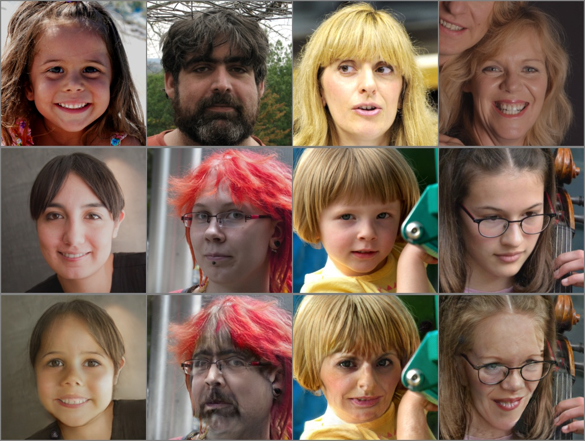
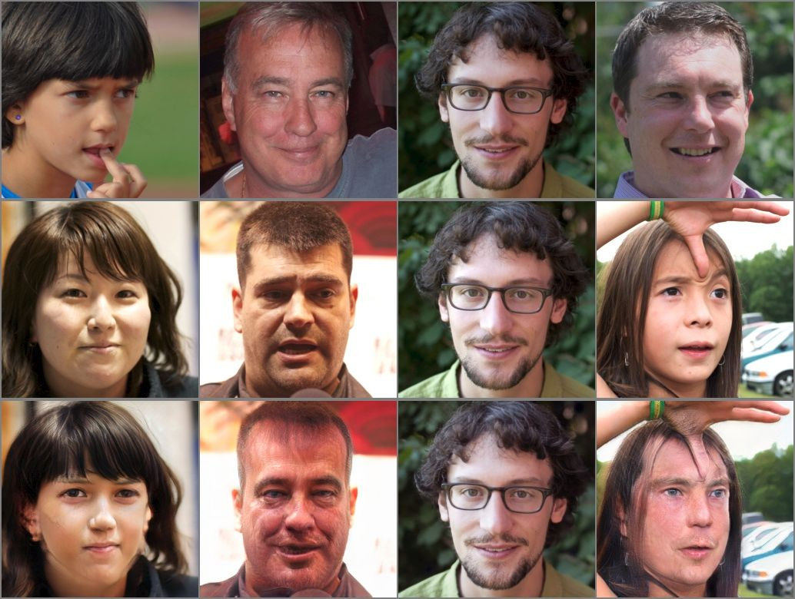
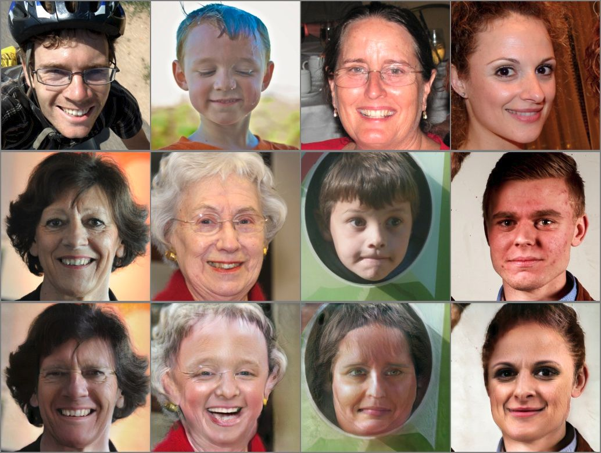
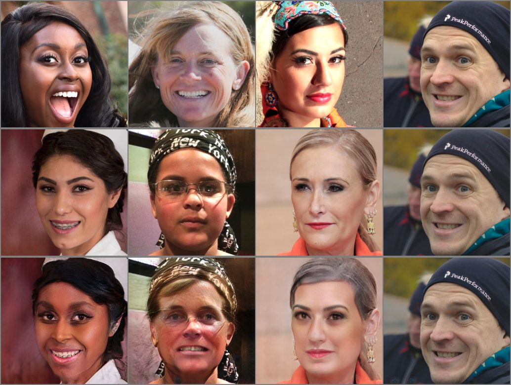

# Face Swapping via Generative Adversarial Networks which sufficient for Person Identification
Higher School of Economics

Applied Mathematics and Computer Science Bachelor's Thesis

Student: Ilya Kontaev

Supervisor: Pavel Shashkin

*Abstract:*

The main objective of this Bachelor’s thesis is to extract the most representative face features via face identification ArcFace model and integrate it into an image of another person via Generative Adversarial Network. The ability to identify original person in this new generated image with use of another identification model must be preserved. The main  difficulties in face swapping are how to extract and recombine identity and attributes of two images in adaptive way. This problem solved with specific Adaptive Embedding Integration Network architecture. Generated images are not without flaws, but they are looking more pleasant and neat than results from previous 3D representation based or other GAN methods face swapping methods.

## Datasets
[FFHQ](https://https://github.com/NVlabs/ffhq-dataset) for both train and validation(separate 1k images)

## Models
- [ArcFace](https://github.com/deepinsight/insightface)
- AIE-NET from FaceShifter([paper](https://arxiv.org/abs/1912.13457), [code for inspiration](https://github.com/taotaonice/FaceShifter))

## Results

